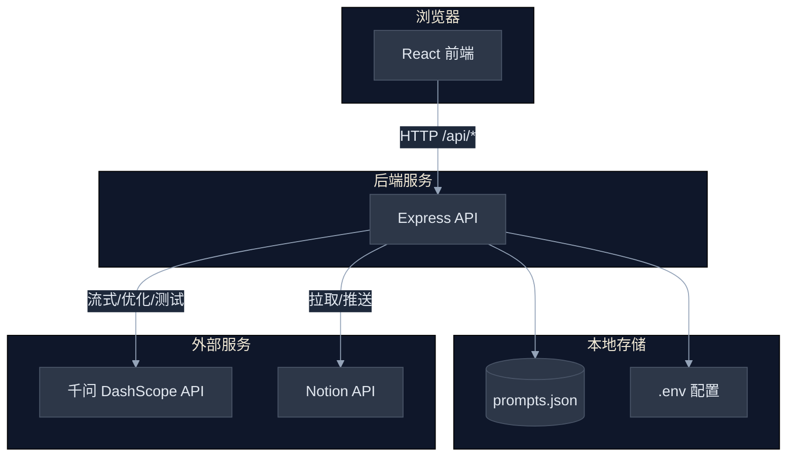
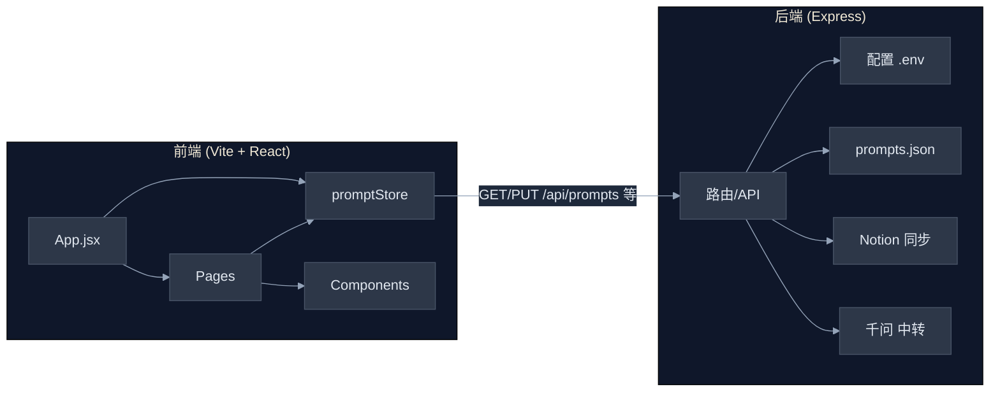
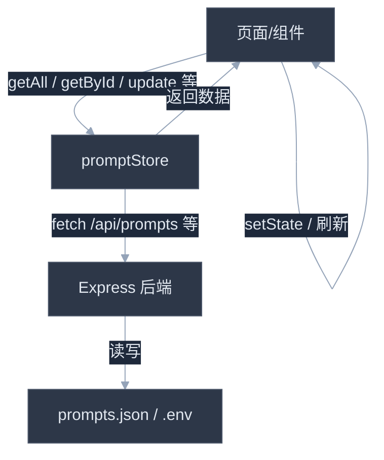
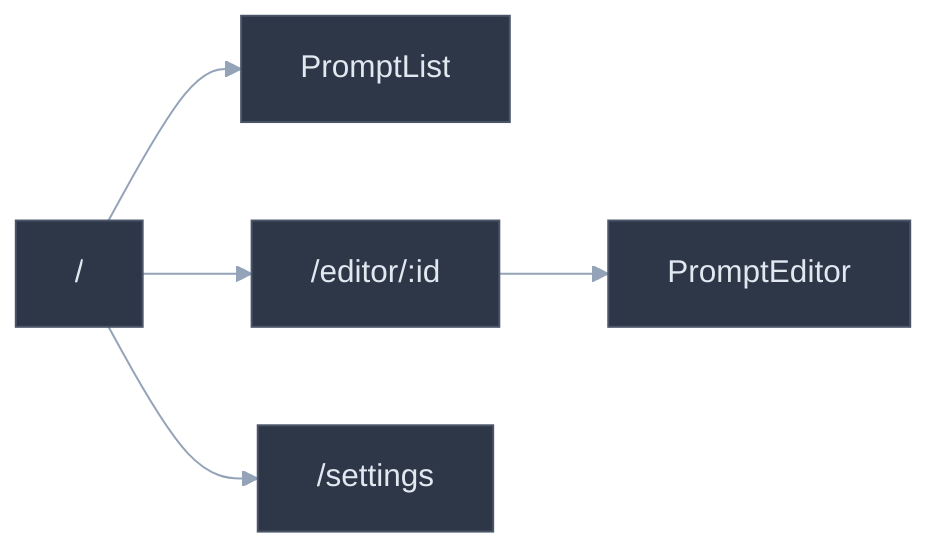
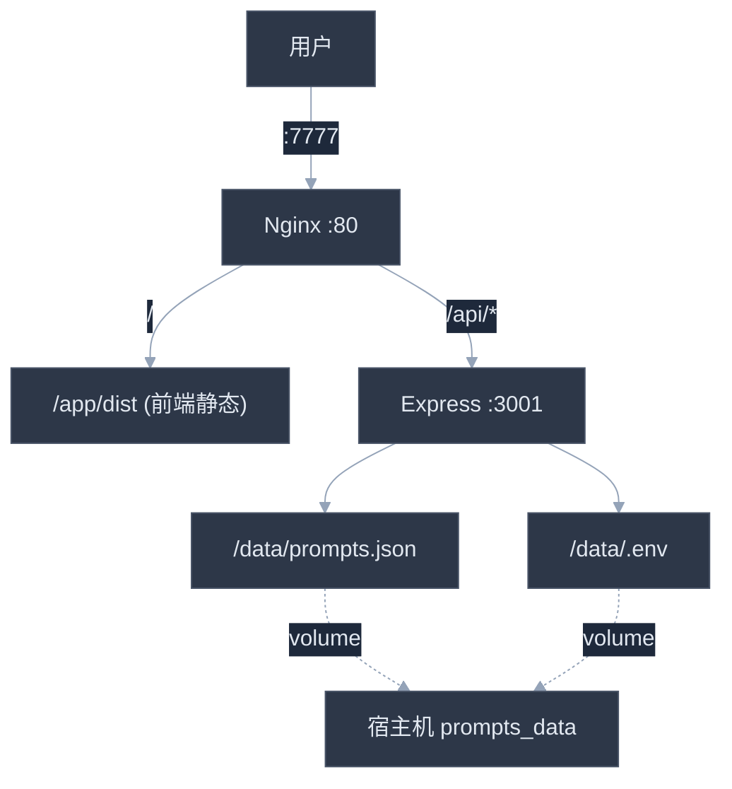

# Prompt 管理工具 — 架构文档

本文档描述项目的整体架构、模块划分、数据流与部署方式。

---

## 1. 系统概览

本系统是一个 **前后端分离** 的 Prompt 管理应用：前端用 React + Vite，后端用 Express，数据存本地 JSON 文件，支持千问 API 测试、Notion 双向同步、Docker 单容器部署。

> 上图：浏览器只和后端通信；后端负责读写本地文件并转发到千问、Notion。

---

## 2. 整体架构图

- **前端**：单页应用，路由 + 页面 + 组件 + 统一通过 `promptStore` 调后端。
- **后端**：Express 提供 REST API，负责配置、JSON 数据、Notion、千问代理。

---

## 3. 前端架构

### 3.1 目录与职责

| 路径 | 职责 |
|------|------|
| `src/App.jsx` | 布局、侧边栏、路由（/、/editor/:id、/settings） |
| `src/main.jsx` | 入口，挂载 React、Router |
| `src/store/promptStore.js` | 所有 Prompt 的 CRUD、变量解析、导入导出，唯一与 `/api` 通信 |
| `src/pages/PromptList.jsx` | 首页列表、搜索、标签筛选、导入导出 |
| `src/pages/PromptEditor.jsx` | 单条编辑、保存、测试、历史、推 Notion、优化 |
| `src/pages/Settings.jsx` | 在线配置 API Key、Notion、密码等 |
| `src/components/NotionSync.jsx` | 从 Notion 拉取并合并到本地 |
| `src/components/TestPanel.jsx` | 填变量、调千问、流式展示 |
| `src/components/HistoryView.jsx` | 历史记录列表、还原 |
| `src/components/PromptCard.jsx` | 列表页单条卡片展示 |
| `src/styles/index.scss` | 全局样式 |

### 3.2 数据流（前端）

- 所有服务端数据都经 `promptStore`，没有散落的 `fetch`。
- 列表数据由 App 的 `prompts` state 持有，通过 `onDataChange` 在编辑/同步后刷新。

### 3.3 路由结构

---

## 4. 后端架构

### 4.1 技术栈与入口

- **运行时**：Node.js，ES Module（`"type": "module"`）。
- **入口**：`server/index.js`，直接 `createServer(app).listen(PORT)`。
- **配置**：优先读项目根目录 `.env` 文件（Settings 页会写这里），没有则用环境变量；Docker 下数据目录为 `/data`，通过软链把 `/data/.env`、`/data/prompts.json` 指到应用目录。

### 4.2 API 一览

| 方法 | 路径 | 说明 |
|------|------|------|
| GET | `/api/health` | 健康检查，返回是否配置了 API Key |
| GET | `/api/prompts` | 返回全部 Prompt 列表 |
| PUT | `/api/prompts` | 覆盖写入全部 Prompt（body 为数组） |
| POST | `/api/chat` | 千问对话（支持流式、多模态） |
| POST | `/api/optimize` | 调用千问优化 Prompt 内容（流式） |
| GET | `/api/notion/sync` | 从 Notion 拉取并合并到本地 |
| POST | `/api/notion/push` | 将指定本地 Prompt 推送到 Notion |
| GET | `/api/config` | 读取当前配置（供 Settings 用） |
| POST | `/api/config` | 写入配置到 .env |

### 4.3 千问与 Notion 的职责

- **千问**：`/api/chat` 根据是否带图片选择文本生成或多模态接口，流式 SSE 原样转发；`/api/optimize` 固定走文本生成、流式返回。
- **Notion**：拉取时查数据库 + 每页取 blocks 取正文，转成本地格式（`${var}` → `{{var}}`）；推送时根据是否有 `notionId` 决定创建或更新页面，正文用 code block 写入，变量格式 `{{var}}` → `${var}`。

---

## 5. 部署架构（Docker）

单容器内同时跑 **Nginx** 和 **Node**：Nginx 提供静态资源和反向代理，Node 只提供 API。

- **Dockerfile**：多阶段构建，先构建前端（`VITE_BASE=/`），再在运行镜像里装 Nginx、装后端依赖，把 `dist` 和 `server` 拷进去，数据目录 `/data` 挂 volume。
- **docker-entrypoint.sh**：先初始化 `/data/prompts.json`（若无），再后台启动 `node server/index.js`，最后前台 `nginx -g "daemon off;"`。
- **nginx.conf**：根路径走静态；`/api/` 反代到 `127.0.0.1:3001`，关闭缓冲、长超时，以支持 SSE。

---

## 6. 数据与配置

### 6.1 prompts.json

- 位置：开发时为项目根目录 `prompts.json`，Docker 为 volume 映射的 `/data/prompts.json`。
- 结构：JSON 数组，每项为一条 Prompt，包含 `id、name、description、content、variables、tags、model、history、createdAt、updatedAt` 等；若从 Notion 同步则有 `notionId`。
- 变量：内容中支持 `{{var}}` 与 `${var}`，后端 Notion 转换时用 `{{var}}` 与 Notion 的 `${var}` 互转。

### 6.2 .env 配置项

| 变量 | 说明 |
|------|------|
| `DASHSCOPE_API_KEY` | 千问 API Key，测试/优化必填 |
| `NOTION_TOKEN` | Notion Integration Token |
| `NOTION_DATABASE_ID` | Notion 数据库 ID |
| `ADMIN_PASSWORD` | 可选，管理员密码 |
| `PORT` | 后端端口，默认 3001 |

配置由后端实时读文件，Settings 页修改后无需重启。

---

## 7. 小结

- **前端**：React 单页，路由 + promptStore 集中请求后端，页面与组件只做展示与交互。
- **后端**：Express 单文件提供 REST + 读写在线配置与 JSON 数据 + 千问代理 + Notion 拉取/推送。
- **部署**：Docker 单容器，Nginx 静态 + 反代 API，数据与配置通过 volume 持久化。

如需扩展，可考虑：将 `server/index.js` 按路由拆成多个模块、前端按功能再拆子模块、或为 Notion/千问 抽成独立 service 层，当前规模下单文件 + 单 store 已足够清晰易维护。
